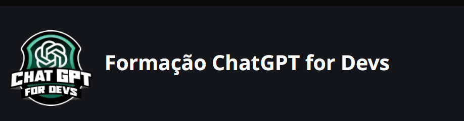

# Formação ChatGPT for Devsw

## Onboarding

Formação Dio que traz como objetivo entender como trabalhar com GhatGPT no desenvolvimento de software. Explorando diversos conceitos básicos, desde a criação de prompts assertivos e o uso de modelos como assistentes virtuais para desenvolvimento.

# Modulos do curso

- [Primeiros Passos como HTML - Part 1](./Primeiros%20Passos%20com%20HTML/Historia%20da%20Internet%20copy.md)
- [Primeiros Passos como HTML - part 2](./Primeiros%20Passos%20com%20HTML/Introducao%20html%20na%20Pratica.md)
- [HTML I: Conceitos Básicos](./HTML%20I%20Coneceitos%20Basicos/README.md)
- [HTML II: Ampliando o Conhecimento](./HTML%20II%20Ampliando%20Conhecimento/README.md)

# links de apoio

[Apresentação Conteudos introdutórios](https://academiapme-my.sharepoint.com/:p:/g/personal/renato_dio_me/EWgg3UxUJt1GhLwXu6Z0L1cB7EhiHOoMQ-8vECmYXzDwYA?rtime=pDVgOzPx3Eg)
[HTML na PRática](https://academiapme-my.sharepoint.com/:p:/g/personal/renato_dio_me/EUBD7085ULpApq4i1_8fWfMBhVJQMyxt2K_d1sJOhRUN_w?e=vk37t3)
[Introdução ao desenvolvimento Moderno de Software](https://web.dio.me/course/introducao-ao-desenvolvimento-moderno-de-software/learning/43322252-a64a-4d20-999e-2cecbb32cfe1)
